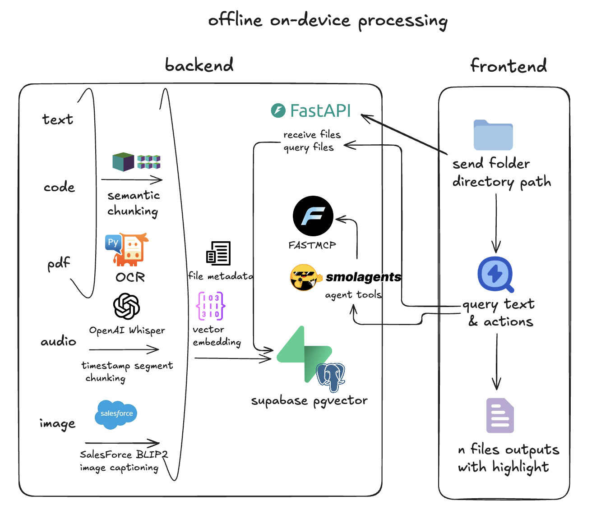

# DeepFind

## Setup: 
1. install docker desktop. [documentation](https://docs.docker.com/desktop/)
2. install local supabase library via brew. [documentation](https://supabase.com/docs/guides/local-development?queryGroups=package-manager&package-manager=brew)
3. run `supabase db reset` then `supabase start` to apply migrations.
4. initialize and activate a virtual environment
5. run `pip install -r requirements.txt`
6. navigate into the `backend` folder and run `python -m app.main`
7. navigate into the `frontend` folder and run `npm i`, then `npm run dev`. This should install and get the application running.
You can also achieve the same thing by running the `run.sh` script in project root folder.
8. Ensure you have Gemma installed on your local device using Ollama
```bash
   # Install Ollama (if not installed)
  brew install ollama

  # Start Ollama server (in a separate terminal)
  ollama serve

  # Pull the gemma2 model
  ollama pull gemma2:9b
  ```
